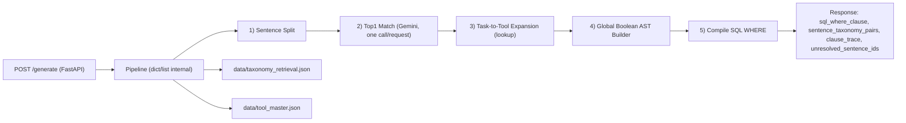

# jd2q-demo MVP API（日本語）

JDテキストを、固定ルールの5レイヤーで SQL `WHERE` 条件に変換するローカル実行用MVPです。

## 目的

- 入力: JDの `must` / `nice` セクション
- 出力: `sql_where_clause`, `sentence_taxonomy_pairs`, `clause_trace`, `unresolved_sentence_ids`
- 範囲: ローカルデモ（DBなし、認証なし、エンドポイント1本）

## パイプライン構成

1. Sentence Split
2. Top1 Match（Gemini + 候補フィルタ）
3. Task-to-Tool Expansion（lookupのみ）
4. Global Boolean AST Builder
5. Compile SQL WHERE



## セットアップ

```bash
python3 -m pip install -r requirements.txt
```

## 実行

```bash
uvicorn app.main:app --reload
```

## Gemini設定

- 必須: `GEMINI_API_KEY`
- 任意: `GEMINI_MODEL`（既定: `gemini-2.5-flash-lite`）
- 任意: `GEMINI_TIMEOUT_SECONDS`（既定: `15`）

`.env` の例:

```bash
cat > .env <<'EOF'
GEMINI_API_KEY=your_key_here
EOF
```

`GEMINI_API_KEY` 未設定時、Top1は安全フォールバックで `taxonomy_row_no: null` を返します。

## サンプルリクエスト

```bash
curl -X POST "http://127.0.0.1:8000/generate" \
  -H "Content-Type: application/json" \
  -d '{
    "jd_id": "jd_0001",
    "j2q_model": "v1",
    "sections": [
      {
        "section_name": "must",
        "text": "Monitor KPIs using BI dashboards."
      },
      {
        "section_name": "nice",
        "text": "Experience designing data transformation and orchestration workflows is a plus."
      }
    ],
    "taxonomy_retrieval_json_path": "data/taxonomy_retrieval.json",
    "tool_master_json_path": "data/tool_master.json"
  }'
```

## サンプルレスポンス（shape）

```json
{
  "jd_id": "jd_0001",
  "j2q_model": "v1",
  "sql_where_clause": "(...)",
  "sentence_taxonomy_pairs": [
    {
      "sentence_id": 1,
      "sentence": "...",
      "section": "must",
      "taxonomy_row_no": 20,
      "task_doc": "..."
    }
  ],
  "clause_trace": [
    {
      "section": "must",
      "sentence_id": 1,
      "sentence": "...",
      "taxonomy_row_no": 20,
      "task_doc": "...",
      "tool_code": "BI",
      "terms_operator": "OR",
      "terms": ["Tableau", "Power BI", "Looker"]
    }
  ],
  "unresolved_sentence_ids": []
}
```

## 注意

本実装はMVPです。決定論・契約整合・疎通確認を優先しています。

## 既知の制約

- MVP用途（ローカル実演）を前提としており、プロダクション向けの堅牢化は未実施です。
- Top1マッチは Gemini と候補フィルタに依存し、精度はモデル応答とマスタデータ品質に影響されます。
- Compile出力は固定の `tool_text` 検索式（`LOWER(tool_text) LIKE ...`）を生成するのみで、DB実行は行いません。
- 認証/認可、DB、バックグラウンドジョブ、監視、レート制御は未対応です。
- 包括的な自動テストスイートは未整備で、現状は契約検証スクリプト中心です。
- マスタJSONの欠損・不整形があると出力品質が低下する可能性があります。

## 契約検証（E2E）

実行コマンド:

```bash
python3 verify_generate_contract.py
```

ローカル実行結果の例:

```text
PASS: Case A
PASS: Case B
```
