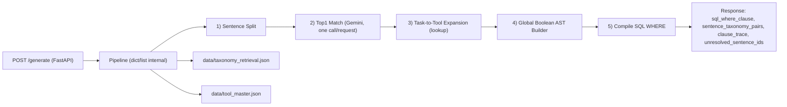

# jd2q-demo MVP API

Local runnable MVP for converting JD text into a deterministic SQL `WHERE` clause trace via a fixed 5-layer pipeline.

## Purpose

- Input: JD sections (`must` / `nice`)
- Output: `sql_where_clause`, `sentence_taxonomy_pairs`, `clause_trace`, `unresolved_sentence_ids`
- Scope: local demo (no DB, no auth, single endpoint)

## Pipeline

1. Sentence Split
2. Top1 Match (Gemini + candidate filtering)
3. Task-to-Tool Expansion (lookup only)
4. Global Boolean AST Builder
5. Compile SQL WHERE



## Install

```bash
python3 -m pip install -r requirements.txt
```

## Run

```bash
uvicorn app.main:app --reload
```

## Gemini Config (Top1 Match)

- Required env var: `GEMINI_API_KEY`
- Optional env var: `GEMINI_MODEL` (default: `gemini-2.5-flash-lite`)
- Optional env var: `GEMINI_TIMEOUT_SECONDS` (default: `15`)

You can set these via shell `export` or put them in a project-root `.env` file (auto-loaded by the app for Top1 Match).
Minimal `.env`:

```bash
cat > .env <<'EOF'
GEMINI_API_KEY=your_key_here
EOF
```

If `GEMINI_API_KEY` is not set, Top1 Match falls back deterministically and returns `taxonomy_row_no: null` for each sentence.

Top1 Match uses one Gemini call per request. Before that call, each sentence gets a hard candidate filter:
- If sentence text contains any tool term from `tool_master.json`, candidates are restricted to taxonomy rows sharing matched `tool_code`s.
- If no tool term matches, full retrieval taxonomy is used for that sentence.

## Sample Request

```bash
curl -X POST "http://127.0.0.1:8000/generate" \
  -H "Content-Type: application/json" \
  -d '{
    "jd_id": "jd_0001",
    "j2q_model": "v1",
    "sections": [
      {
        "section_name": "must",
        "text": "Monitor KPIs using BI dashboards."
      },
      {
        "section_name": "nice",
        "text": "Experience designing data transformation and orchestration workflows is a plus."
      }
    ],
    "taxonomy_retrieval_json_path": "data/taxonomy_retrieval.json",
    "tool_master_json_path": "data/tool_master.json"
  }'
```

## Sample Response (shape)

```json
{
  "jd_id": "jd_0001",
  "j2q_model": "v1",
  "sql_where_clause": "(...)",
  "sentence_taxonomy_pairs": [
    {
      "sentence_id": 1,
      "sentence": "...",
      "section": "must",
      "taxonomy_row_no": 20,
      "task_doc": "..."
    }
  ],
  "clause_trace": [
    {
      "section": "must",
      "sentence_id": 1,
      "sentence": "...",
      "taxonomy_row_no": 20,
      "task_doc": "...",
      "tool_code": "BI",
      "terms_operator": "OR",
      "terms": ["Tableau", "Power BI", "Looker"]
    }
  ],
  "unresolved_sentence_ids": []
}
```

## Known Limitations

- MVP scope: designed for local demonstration, not production hardening.
- Top1 matching relies on Gemini and candidate filtering; quality depends on model responses and master data quality.
- Compile output currently targets a fixed `tool_text` search pattern (`LOWER(tool_text) LIKE ...`) and does not execute against a DB.
- No authentication, authorization, database, background jobs, monitoring, or rate limiting.
- No comprehensive automated test suite beyond the included contract verification script.
- Data assumptions are strict: malformed/partial master JSON may degrade output quality.

## Contract Verification

Run:

```bash
python3 verify_generate_contract.py
```

Latest local output example:

```text
PASS: Case A
PASS: Case B
```

Note: this is an MVP implementation focused on deterministic behavior and contract validation.
